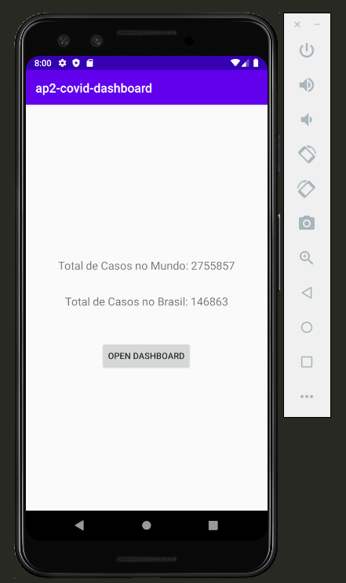
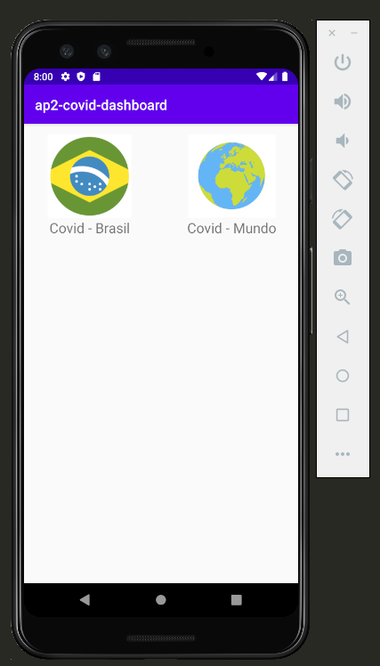
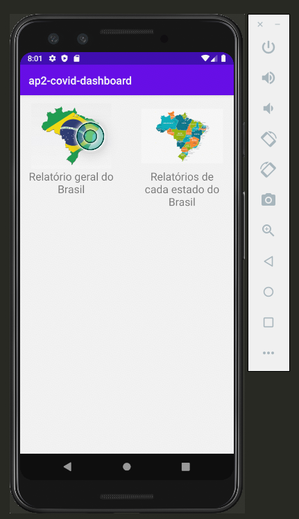
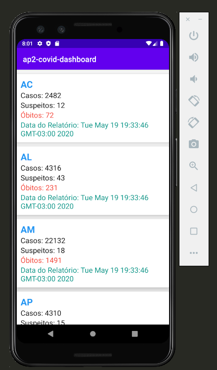
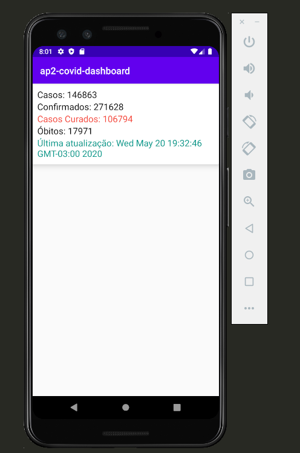
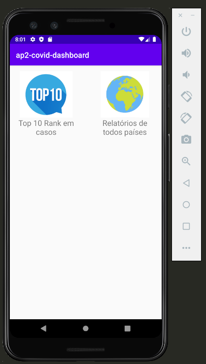
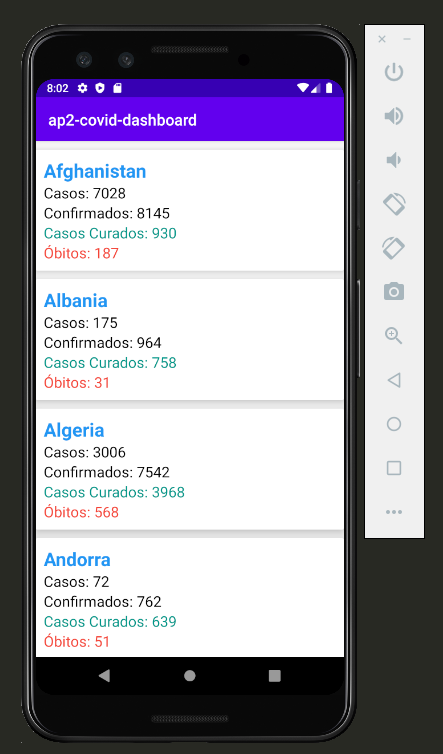
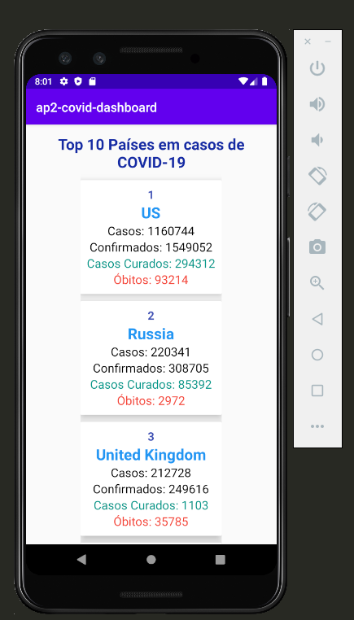

# ap2-covid-dashboard

 Main Screen 

 Menu para escolher entre Bolentins do Brasil ou do Mundo 

 Menu Principal de Opções para o Brasil 

 Boletins por Estados Brasileiros 

 Boletins do Brasil 

 Boletim geral do Mundo 

 Boletm de todos os paises 

 Top 10 Paises em numeros de casos 

